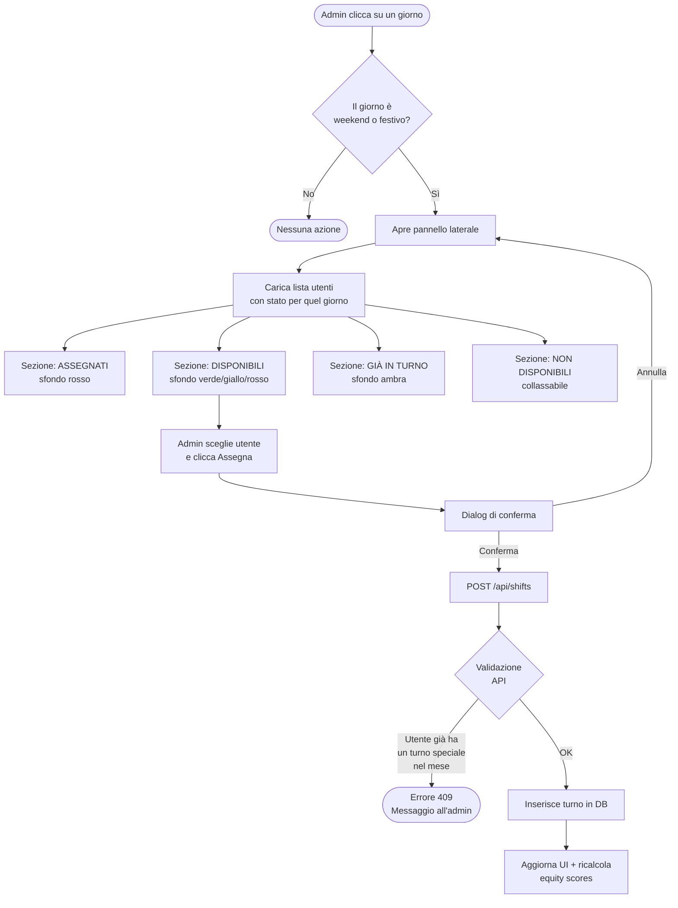
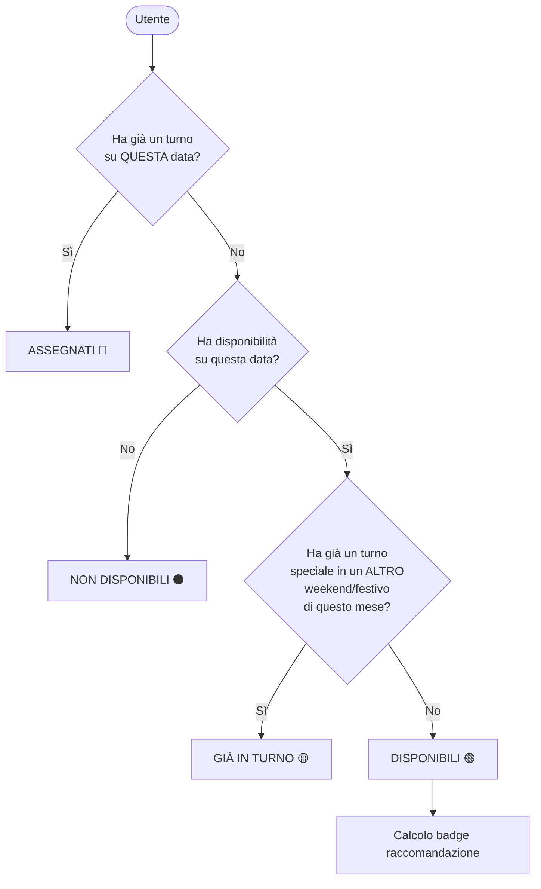
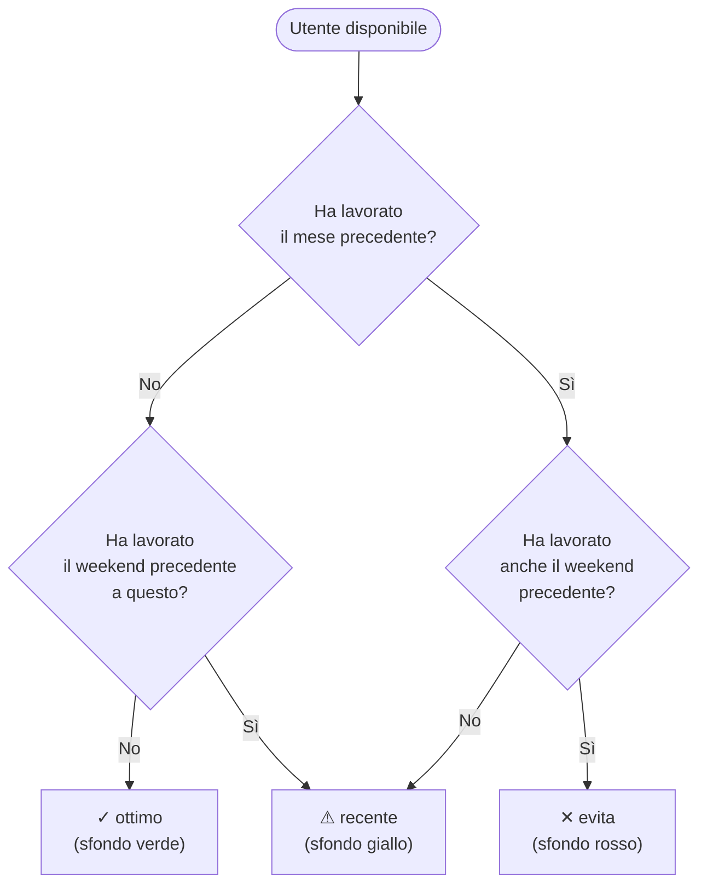
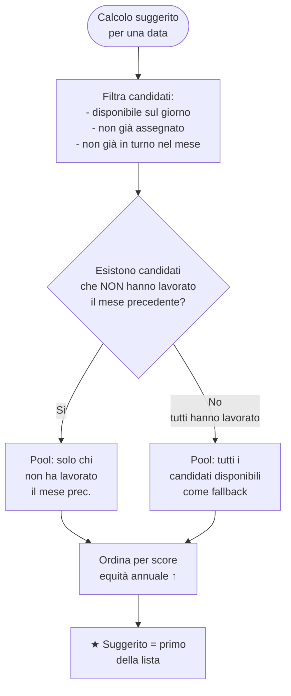
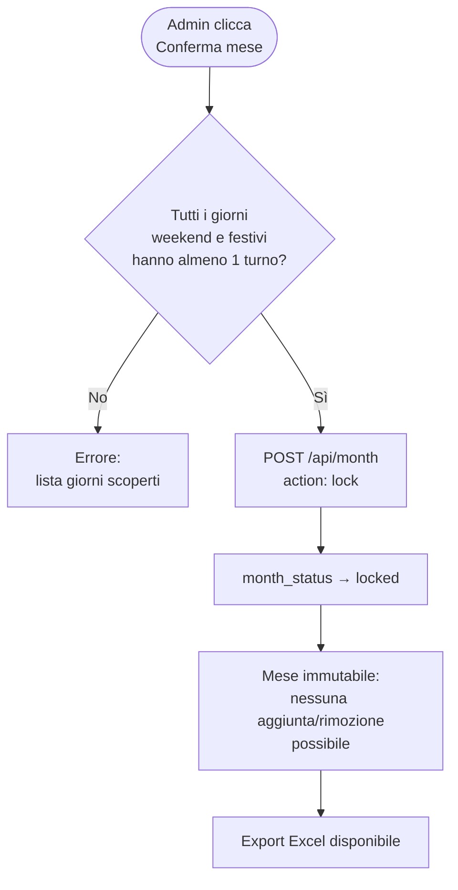

# Logica di Turnazione — Turnify

Questo documento descrive il funzionamento del sistema di assegnazione turni di reperibilità.

---

## Tipi di turno

| `shift_type` | Quando si applica |
|---|---|
| `weekend` | Sabato o domenica non festivi |
| `festivo` | Qualsiasi giorno presente in tabella `holidays` |
| `reperibilita` | Feriale non festivo (raro, uso futuro) |

---

## Regola fondamentale: max 1 turno speciale al mese

Un dipendente non può lavorare più di **un turno speciale** (weekend o festivo) per mese.
Un weekend conta come unità unica: sabato + domenica insieme.

```
Turni speciali = weekend (Sab+Dom) + festivi
Max per mese per dipendente = 1
```

---

## Flusso assegnazione turno (admin)



---

## Classificazione utenti nel pannello laterale



---

## Calcolo badge raccomandazione (sezione Disponibili)

I badge indicano se un utente ha lavorato di recente. Sono sempre visibili, anche se nessuno è ancora stato assegnato al giorno.



**Mese precedente**: turni nel mese prima di quello visualizzato.
**Weekend precedente**: il sabato/domenica immediatamente prima del weekend corrente (anche se a cavallo di mese).

---

## Utente Suggerito (★)

Il sistema indica automaticamente l'utente ottimale per ogni giorno.



### Score equità

```
score = turni_totali + (festivi × 2) + (fest_comandate × 3)
```

- Score basso → poca esperienza → alta priorità
- Calcolato su **tutti i turni dell'anno corrente** (mesi locked + aperti + assegnati non confermati)
- Si aggiorna in tempo reale dopo ogni assegnazione/rimozione

---

## Ordine di visualizzazione nella sezione Disponibili

```
1. ★ Suggerito       → score annuale più basso tra chi non ha lavorato il mese prec.
2. ✓ ottimo          → non ha lavorato né il mese scorso né il w.e. precedente
3. ⚠ recente         → ha lavorato il mese scorso O il w.e. precedente
4. ✕ evita           → ha lavorato sia il mese scorso che il w.e. precedente
```

---

## Flusso conferma mese (lock)



**Un mese locked non può essere modificato.** Può essere sbloccato dall'admin tramite il pulsante Annulla conferma, che riporta lo stato a `open`.

---

## Domande frequenti

**La classifica aggiorna solo sui mesi confermati?**
No. `get_equity_scores` legge dalla tabella `shifts` senza filtrare su `month_status`. Ogni turno assegnato — anche in un mese non confermato — incide immediatamente sullo score e sui suggerimenti.

**Cosa succede se 1° maggio (festivo) è subito prima del weekend 2-3 maggio?**
Chi lavora il 1° maggio finisce nella sezione "Già in turno" per il weekend successivo, e non può essere riassegnato. La regola vale anche in direzione inversa.

**Il sistema può suggerire chi ha già lavorato il mese precedente?**
Solo come fallback, se tutti gli utenti disponibili hanno lavorato il mese precedente. In quel caso viene indicato il badge ⚠ o ✕ per avvisare l'admin.
