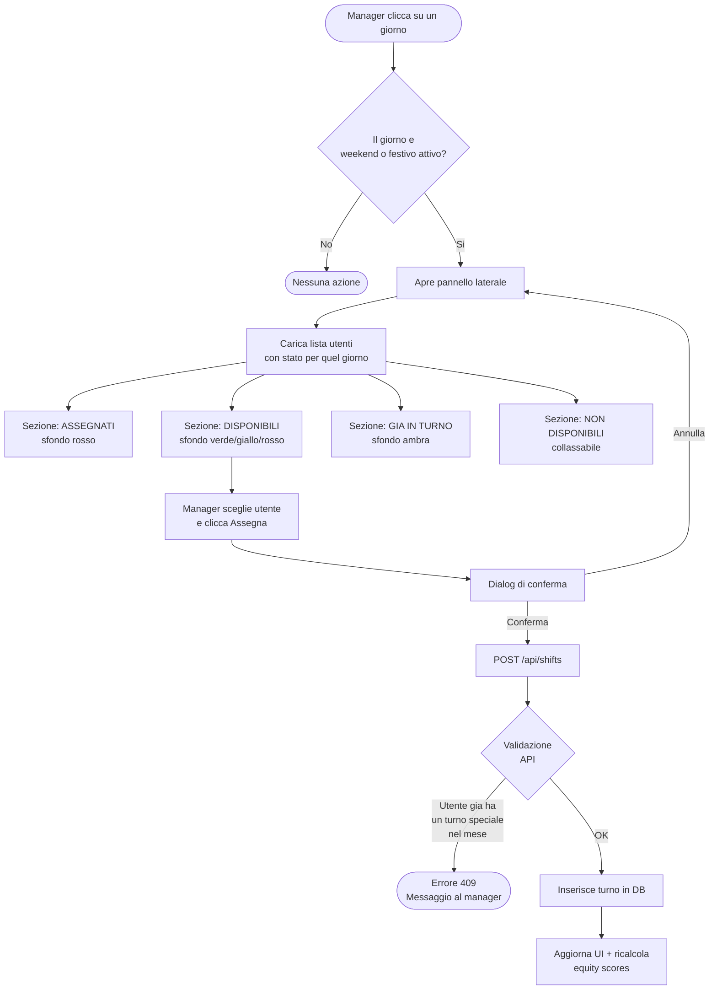
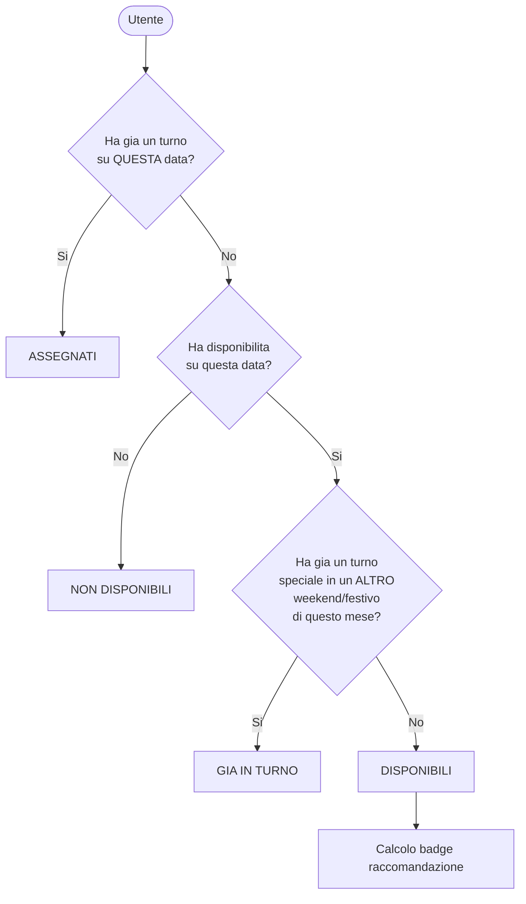
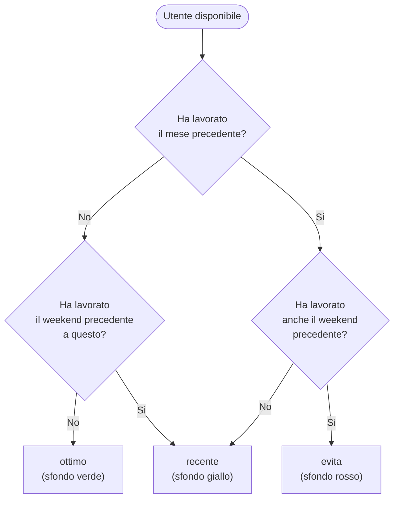
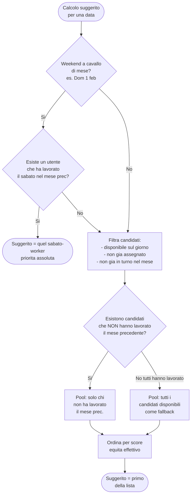
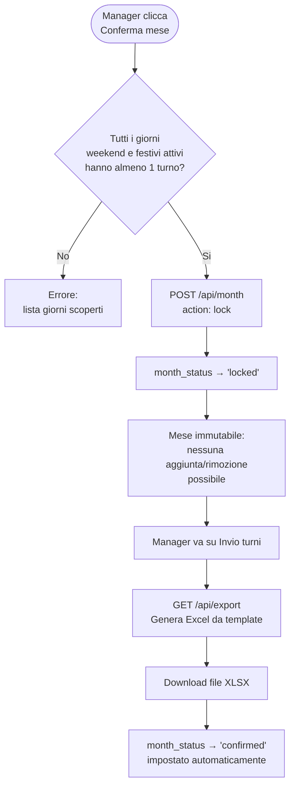

# Logica di Turnazione — Turnify

Questo documento descrive il funzionamento del sistema di assegnazione turni di reperibilita.

---

## Tipi di turno

| `shift_type` | Quando si applica |
|---|---|
| `weekend` | Sabato o domenica non festivi |
| `festivo` | Giorno presente in `holidays` con `mandatory = true` (festivita attiva). Giorni con `mandatory = false` sono ignorati e trattati come giorni normali. |
| `reperibilita` | Feriale non festivo (raro, uso futuro) |

---

## Regola fondamentale: max 1 turno speciale al mese

Un dipendente non puo lavorare piu di **un turno speciale** (weekend o festivo attivo) per mese.
Un weekend conta come unita unica: sabato + domenica insieme.

```
Turni speciali = weekend (Sab+Dom) + festivi attivi (mandatory=true)
Max per mese per dipendente = 1
```

---

## Flusso assegnazione turno (manager)



---

## Classificazione utenti nel pannello laterale



---

## Calcolo badge raccomandazione (sezione Disponibili)

I badge indicano se un utente ha lavorato di recente. Sono sempre visibili, anche se nessuno e ancora stato assegnato al giorno.



**Mese precedente**: turni nel mese prima di quello visualizzato.
**Weekend precedente**: il sabato/domenica immediatamente prima del weekend corrente (anche se a cavallo di mese).

---

## Utente Suggerito

Il sistema indica automaticamente l'utente ottimale per ogni giorno.



### Score equita (formula aggiornata — migration 010)

```
score_storico   = turni_totali + (festivi_attivi x 2)
score_effettivo = score_storico + turni_assegnati_in_questa_sessione
```

Dove `festivi_attivi` = turni su giorni con `holidays.mandatory = true`.
Ogni turno su festivita attiva vale 3 pt in totale (1 base + 2 extra dal moltiplicatore).

Lo **score effettivo** combina due fonti:

| Fonte | Quando si aggiorna | Scopo |
|---|---|---|
| `score_storico` (dal DB via RPC) | Ad ogni navigazione di mese | Conta tutti i turni dell'anno, inclusi mesi non confermati |
| `sessionCounts` (in memoria) | Ad ogni assegnazione nel mese corrente | Corregge il suggerito tra slot dello stesso mese senza rileggere il DB |

**Perche due fonti?**
`fetchAuxData` richiama il DB solo quando si naviga a un altro mese. Se si assegnano piu slot nello stesso mese senza navigare, `score_storico` resta invariato e il sistema suggerirebbe sempre lo stesso utente. `sessionCounts` risolve questo contando i turni gia presenti in `shifts` (aggiornati ottimisticamente dopo ogni click).

### Consistenza cross-mese

Poiche ogni assegnazione viene salvata immediatamente in DB via `POST /api/shifts` (indipendentemente dalla conferma del mese), quando si naviga al mese successivo `fetchAuxData` legge gia i turni appena inseriti. Il suggerito del nuovo mese e quindi sempre coerente, anche se il mese precedente non e ancora stato confermato/locked.

```
Mese A: assegno turni (entrano in DB) → non confermo
         ↓ navigo a Mese B
Mese B: fetchAuxData → get_equity_scores conta gia i turni di Mese A
```

---

## Ordine di visualizzazione nella sezione Disponibili

```
1. Suggerito       → score annuale piu basso tra chi non ha lavorato il mese prec.
2. ottimo          → non ha lavorato ne il mese scorso ne il w.e. precedente
3. recente         → ha lavorato il mese scorso O il w.e. precedente
4. evita           → ha lavorato sia il mese scorso che il w.e. precedente
```

---

## Flusso conferma mese (lock → confirmed)



**Un mese locked non puo essere modificato.** Puo essere sbloccato dal manager tramite il pulsante "Annulla conferma", che riporta lo stato a `open`.

**Stato `confirmed`**: impostato automaticamente dall'API `/api/export` quando il manager scarica il file Excel. Indica che il mese e stato esportato. Le colonne `email_inviata` e `email_inviata_at` su `month_status` sono presenti ma non ancora usate (in attesa dell'integrazione Resend).

---

## Domande frequenti

**La classifica aggiorna solo sui mesi confermati?**
No. `get_equity_scores` legge dalla tabella `shifts` senza filtrare su `month_status`. Ogni turno assegnato — anche in un mese non confermato — incide sullo score al successivo cambio mese.

**Quando si aggiornano gli equity scores?**
In due momenti distinti:
1. **Cambio mese** (navigazione nel calendario) → `fetchAuxData` richiama il DB → `score_storico` aggiornato
2. **Intra-mese** (piu assegnazioni nello stesso mese senza navigare) → `sessionCounts` in memoria → `score_effettivo` aggiornato localmente

Non c'e nessuna chiamata al DB aggiuntiva dopo ogni singola assegnazione.

**Cosa succede se 1 maggio (festivo attivo) e subito prima del weekend 2-3 maggio?**
Chi lavora il 1 maggio finisce nella sezione "Gia in turno" per il weekend successivo, e non puo essere riassegnato. La regola vale anche in direzione inversa.

**Il sistema puo suggerire chi ha gia lavorato il mese precedente?**
Solo come fallback, se tutti gli utenti disponibili hanno lavorato il mese precedente. In quel caso viene indicato il badge "recente" o "evita" per avvisare il manager.

**Cosa si intende per "festivita attiva"?**
Una festivita e attiva quando il campo `mandatory` nella tabella `holidays` e `true`. Solo queste festivita compaiono sul calendario come giorni speciali, possono ricevere un turno di tipo `festivo`, e incidono sullo score equita. Le festivita con `mandatory = false` sono invisibili al sistema operativo.
